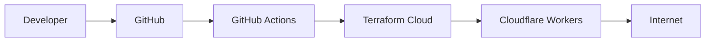

# Terraform Cloudflare Worker Demo

This project deploys a NodeJS application on Cloudflare Workers using Terraform Cloud and GitHub Actions.

## 🛠️ Installation

Clone the repository:
```bash
git clone https://github.com/r3xakead0/terraform-cloudflare-worker.git
cd terraform-cloudflare-worker
```

## 📁 Structure

```
terraform-cloudflare-worker/
├── Infrastructure/
    ├── main.tf
    ├── provider.tf
    ├── variables.tf
    ├── outputs.tf
├── app/
    ├── worker.tf
├── .github/
    ├── workflows/
        ├── deploy.yml
        ├── destroy.yml
```

## ▶️ Run Worker locally

1. Install Wrangler:

```bash
npm install -g wrangler
wrangler --version
```

2. Start the worker:

```bash
cd app
wrangler dev worker.js
```

3. Open in browser:

[http://localhost:8787](http://localhost:8787)


## 🔐 Secrets required on GitHub

Configuration:

- TF_API_TOKEN (Terraform Cloud)
- CLOUDFLARE_API_TOKEN
- CLOUDFLARE_ACCOUNT_ID

## 🚀 Deploy

Ejecutar manualmente:

```
Actions → Deploy Worker → Run workflow
```

## 💥 Destroy

Ejecutar manualmente:

```
Actions → Destroy Worker → Run workflow
```

## 🌐 Endpoints

- `/`
- `/time`

## 🧠 Workflow



## 📄 License

This project is licensed under the MIT License - see the [LICENSE](LICENSE) file for details.


## 📞 Support

For issues, questions, or contributions, please visit the [GitHub repository](https://github.com/r3xakead0/terraform-cloudflare-worker).