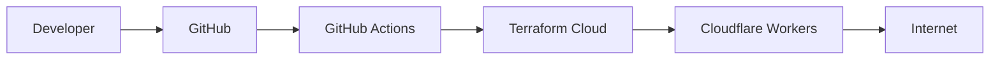

# Terraform Cloudflare Worker Demo

This project deploys a NodeJS application on Cloudflare Workers using Terraform Cloud and GitHub Actions.

## 🛠️ Installation

Clone the repository:
```bash
git clone https://github.com/r3xakead0/terraform-cloudflare-worker.git
cd terraform-cloudflare-worker
```

## 📁 Structure

```
terraform-cloudflare-worker/
├── terraform/
    ├── main.tf
    ├── provider.tf
    ├── variables.tf
    ├── outputs.tf
├── app/
    ├── worker.tf
├── .github/
    ├── workflows/
        ├── deploy.yml
        ├── destroy.yml
```

## ▶️ Run Worker locally

1. Install Wrangler:

```bash
npm install -g wrangler
wrangler --version
```

2. Start the worker:

```bash
cd app
wrangler dev worker.js
```

3. Open in browser:

[http://localhost:8787](http://localhost:8787)

### 🛠️ Terraform Cloud Token

1. Login to [Terraform Cloud](https://app.terraform.io/) 
2. Go to **Account Settings → Tokens**
3. Click **Create a API token** and name it `github-actions-token`
4. Copy and save the token as a GitHub secret named: 
   - `TF_API_TOKEN`

## 🛠️ Terraform Cloud Setup

1. Login to [Terraform Cloud](https://app.terraform.io/)
2. Create a new organization named `chainiz` (or your preferred name)
3. Create a new workspace named `cloudflare-worker-demo` (or your preferred name)
4. In the workspace settings:
   - Set "Execution Mode" to "Local" in General option

## ☁️ Cloudflare API Token Permissions

1. Login to [Cloudflare](https://dash.cloudflare.com/)
2. Go to **Manage account -> Account API tokens**
3. Click **Create Token** and select **Custom Token**
4. Token name: `cloudflare_worker_api_token` (or your preferred name)
5. Configure the following permissions:
   - Permissions:
        - Account > Workers Scripts: `Edit`
        - Zone > Workers Routes: `Edit`
   - Zone Resources:
        - Include > All zones from an account: `chainiz`
6. Create and save the token.
7. Store the following secrets in your GitHub repository:
   - `CLOUDFLARE_API_TOKEN`
   - `CLOUDFLARE_ACCOUNT_ID`

## 🔐 Secrets required on GitHub

Configuration:

- TF_API_TOKEN
- CLOUDFLARE_API_TOKEN 
- CLOUDFLARE_ACCOUNT_ID

## 🚀 Deploy

Run manually:

```
Actions → Deploy Worker → Run workflow
```

## 💥 Destroy

Run manually:

```
Actions → Destroy Worker → Run workflow
```

## 🌐 Endpoints

- `/`
- `/time`

## 🧠 Workflow



## 📄 License

This project is licensed under the MIT License - see the [LICENSE](LICENSE) file for details.


## 📞 Support

For issues, questions, or contributions, please visit the [GitHub repository](https://github.com/r3xakead0/terraform-cloudflare-worker).